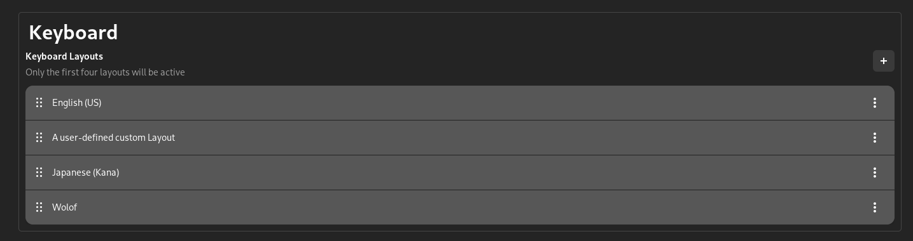
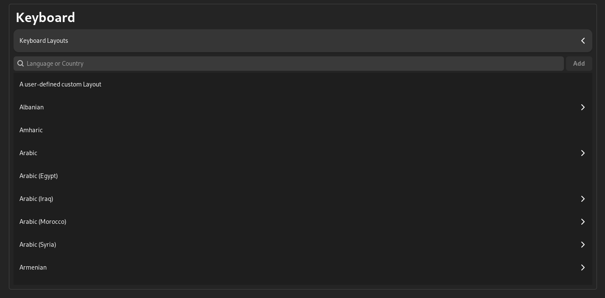

# ReSet-Keyboard

This plugin features the configuration of keyboard layouts. It offers both a DBus interface and a graphical user interface in order to cover a wide range of users.
Note: This plugin uses the XDG standard for handling keyboard layouts, hence only 4 active keyboard layouts are currently allowed. Should a new standard be implemented, this plugin can be adapted for the new standard.

## Environment Support
- Hyprland
- GNOME
- KDE

## Usage

For Hyprland, you would need to add the keyboard.conf file created by this plugin in order to include changes from ReSet into Hyprland.

In your hypr.conf
```hyprlang
source $HOME/.config/reset/keyboard.conf
```

## Configuration

Currently, the only configuration option for this plugin is used by the Hyprland implementation.
It defines where the monitor file is located in which ReSet will write the keyboard configuration for Hyprland to listen to.

```toml
[Keyboard]
path = "$HOME/.config/reset/keyboard.conf"
```
## Screenshots


</div>

</div>
