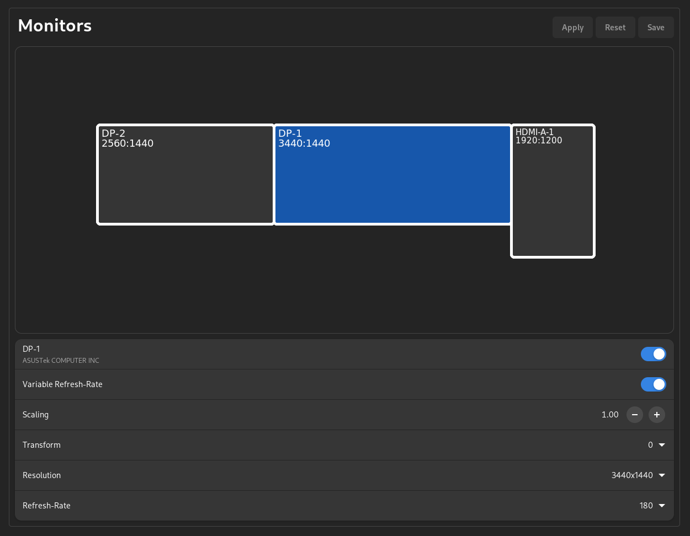

# ReSet-Monitors

This plugin features the configuration of monitors. It offers both a DBus interface and a graphical user interface in order to cover a wide range of users.

## Environment Support

- GOME
- KDE via kscreen / KWIN protocol
- Hyprland via hyprctl parsing and WLR protocols
- WLR -> sway, river, etc

Note: various environments support specific features like VRR, primary monitor support and more. These features will be shown dynamically.
For GNOME, please ensure that fractional scaling and VRR are enabled in the experimental settings if you would like to use them.

## Usage

For Hyprland, you would need to add the keyboard.conf file created by this plugin in order to include changes from ReSet into Hyprland.
Note, this is only necessary if you wish to use persistent monitors configuration via the save button.

In your hypr.conf

```hyprlang
source $HOME/.config/reset/monitors.conf
```

## Configuration

Currently, two configuration flags are supported:

- path: the path for the Hyprland implementation file. This file will be used by Hyprland to offer persistent saving of monitor configurations.
- save_warning: this handles whether the warning banner will be shown on persistently saving configurations.

```toml
[Monitor]
path = "$HOME/.config/reset/monitors.conf"
save_warning = true
```

## Screenshots


</div>
